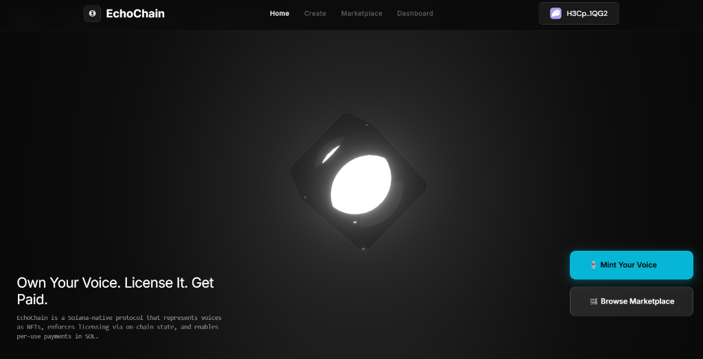
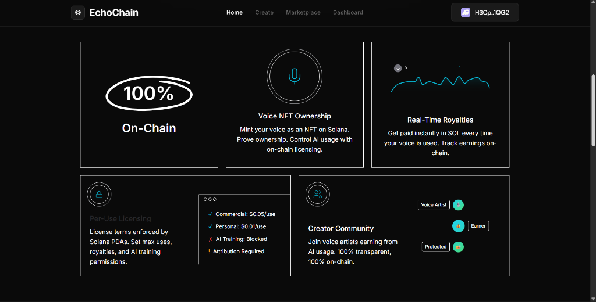
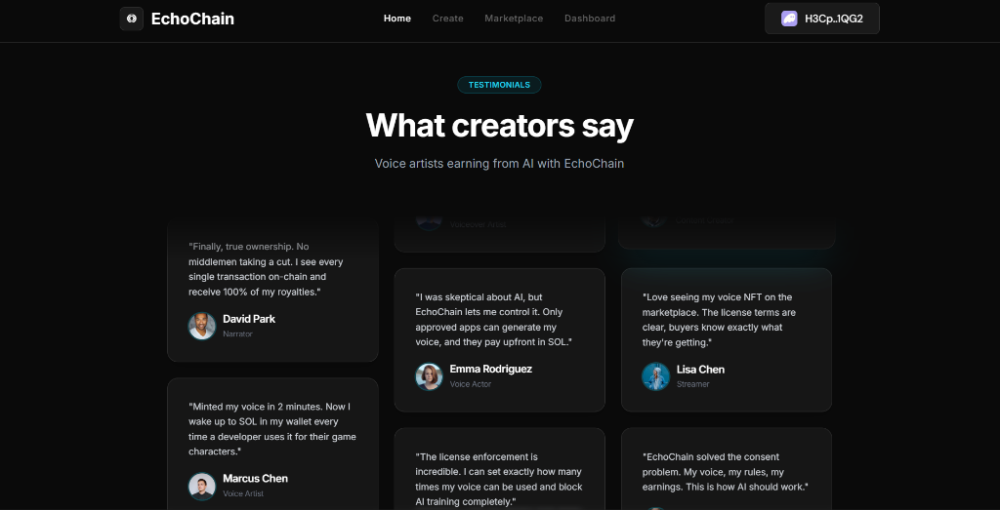
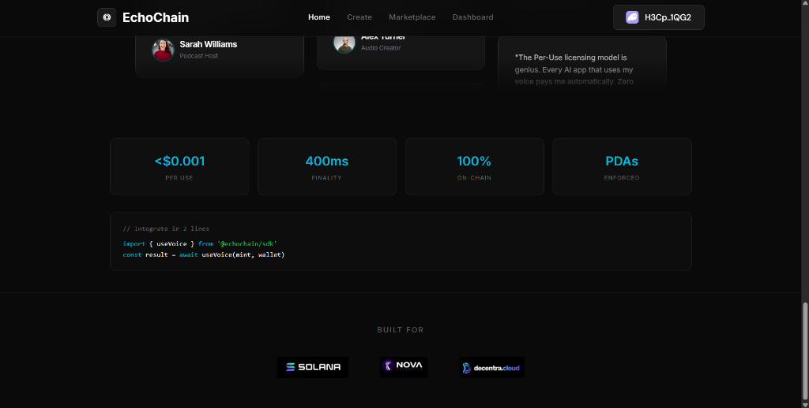
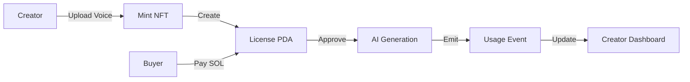

<p align="center">
  
</p>

<h1 align="center">EchoChain</h1>

<p align="center">
  <strong>Voice = NFT + License + Payment</strong>
</p>

<p align="center">
  <a href="#features">Features</a> •
  <a href="#demo">Demo</a> •
  <a href="#architecture">Architecture</a> •
  <a href="#quick-start">Quick Start</a> •
  <a href="#smart-contract">Smart Contract</a> •
  <a href="#tech-stack">Tech Stack</a>
</p>

<p align="center">
  
  
  
  
</p>

---

## 🎯 One-Line Pitch

> **"We use Solana not just for NFTs, but as the enforcement layer for voice licensing, usage limits, and creator payments."**

---

## 📸 Screenshots

<p align="center">
  
</p>

<p align="center">
  
</p>

<p align="center">
  
</p>

<p align="center">
  
</p>

---

## 🧠 Problem

AI can now replicate voices, but **ownership, consent, licensing, and monetization are broken**. Creators have no trustless way to:

- ❌ Prove ownership of their voice
- ❌ License usage transparently
- ❌ Get paid per use without intermediaries
- ❌ Control how AI uses their voice

---

## ✅ Solution

EchoChain is a **Solana-native protocol** that:

| Feature | Description |
|---------|-------------|
| **Voice NFT Minting** | Upload audio → mint NFT with license PDA |
| **Per-Use Payments** | Micropayments in SOL for each usage |
| **License Enforcement** | On-chain tracking of uses, limits, terms |
| **AI Gatekeeper** | AI blocked until Solana approves usage |
| **Creator Dashboard** | Real-time earnings and usage analytics |
| **Marketplace** | Browse, preview, and buy voice licenses |

---

## 🔗 Why Solana?

| Advantage | Benefit |
|-----------|---------|
| ⚡ **< $0.001 per tx** | Makes per-use micropayments viable |
| 🚀 **400ms finality** | Real-time license verification |
| 🔐 **PDAs** | On-chain license enforcement |
| 📡 **Events** | Transparent usage proof for AI apps |
| 🌐 **100% On-Chain** | No backend required |

---

## <a name="features"></a>✨ Features

### 🎙️ Voice NFT Ownership
Mint your voice as an NFT on Solana. Prove ownership. Control AI usage with on-chain licensing.

### 💰 Real-Time Royalties
Get paid instantly in SOL every time your voice is used. Track earnings on-chain.

### 📜 Per-Use Licensing
License terms enforced by Solana PDAs. Set max uses, royalties, and AI training permissions.

### 🤖 AI Gatekeeper
**Absolute Rule**: Solana is the authority. AI must obey Solana.

```
User clicks "Generate with AI"
         ↓
Solana: use_voice() called
         ↓
  IF success → AI allowed
  IF failure → AI blocked
```

---

## <a name="architecture"></a>🏗️ Architecture

```
┌─────────────────────────────────────────────────────────────┐
│                     EchoChain Protocol                       │
├─────────────────────────────────────────────────────────────┤
│  Voice NFT (Metaplex)  →  VoiceLicense PDA  →  UsageRecord  │
│         ↓                      ↓                    ↓        │
│   Ownership Proof       License Terms         Usage Tracking │
└─────────────────────────────────────────────────────────────┘
```

### Data Flow



---

## 📦 Project Structure

```
EchoChain/
├── programs/echochain/      # Anchor smart contract
│   └── src/lib.rs           # VoiceLicense PDA, instructions
├── frontend/                # Next.js 14 app
│   ├── app/
│   │   ├── page.tsx         # Landing page
│   │   ├── create/          # Mint voice NFT
│   │   ├── marketplace/     # Browse & buy voices
│   │   ├── use/[mint]/      # Use voice with AI
│   │   └── dashboard/       # Creator earnings
│   ├── components/          # UI components
│   └── lib/program.ts       # Solana SDK helpers
└── tests/                   # Contract tests
```

---

## <a name="quick-start"></a>🚀 Quick Start

### Prerequisites

- Node.js 18+
- pnpm
- Phantom Wallet (browser extension)
- Solana CLI (optional, for contract deployment)

### Frontend

```bash
cd frontend
pnpm install
pnpm run dev
```

Open [http://localhost:3000](http://localhost:3000)

### Smart Contract (requires Anchor CLI)

```bash
anchor build
anchor test
anchor deploy
```

---

## <a name="smart-contract"></a>📜 Smart Contract

### VoiceLicense PDA

```rust
pub struct VoiceLicense {
    pub nft_mint: Pubkey,
    pub creator: Pubkey,
    pub price_per_use: u64,
    pub max_uses: u32,
    pub remaining_uses: u32,
    pub license_type: u8,      // 0=Personal, 1=Commercial
    pub consent_confirmed: bool,
    pub total_earnings: u64,
}
```

### Instructions

| Instruction | Description |
|-------------|-------------|
| `initialize_voice` | Mint NFT + create license PDA |
| `buy_usage` | Pay SOL → get usage rights |
| `use_voice` | Decrement uses → emit proof |

### Events

- `VoiceInitialized` - New voice minted
- `UsagePurchased` - Usage bought
- `VoiceUsed` - Usage consumed (proof for AI apps)

---

## 🤖 AI Integration

### For Developers

Any AI voice app can integrate EchoChain:

```typescript
import { useVoice } from '@echochain/sdk';

// Returns on-chain proof of licensed usage
const result = await useVoice(voiceMint, wallet);

if (result.success) {
  // AI generation allowed
  generateVoice(audioData);
} else {
  // Blocked - no valid license
  showError("Purchase usage first");
}
```

**No backend required** — the Solana program is the API.

### AI License Explainer

Converts on-chain data to human-readable terms:

```
Input:  { licenseType: 1, pricePerUse: 0.1, remainingUses: 3 }
Output: "Commercial use allowed. 3 uses remaining at 0.1 SOL each."
```

---

## <a name="demo"></a>🎬 Demo Flow (2 min)

1. **Connect Wallet** → Phantom on devnet
2. **Create Voice NFT** → Upload audio, set pricing, mint
3. **Marketplace** → Browse and play voice samples
4. **Buy Usage** → Pay SOL, get license
5. **AI Generate** → Voice generation after Solana approval
6. **Dashboard** → View earnings in real-time

---

## <a name="tech-stack"></a>🛠️ Tech Stack

| Layer | Technology |
|-------|------------|
| **Blockchain** | Solana, Anchor |
| **Frontend** | Next.js 14, TypeScript, Tailwind CSS |
| **Wallet** | @solana/wallet-adapter |
| **Database** | Supabase (voice metadata) |
| **Deployment** | Vercel |
| **NFT Standard** | Metaplex |

---

## ⚖️ Ethical Consent

Every voice mint requires explicit consent confirmation stored on-chain:

> ✅ "I confirm I own the rights to this voice."

This is enforced in both the smart contract and UI.

---

## 🏆 Hackathon Submission

**Track**: AI + Blockchain / DeFi

**Key Innovation**: Using Solana PDAs as the **enforcement layer** for voice licensing — not just NFT minting.

**Why We Win**:
- Real problem (AI voice theft)
- Novel solution (on-chain licensing)
- Working demo (try it live!)
- Solana-native design

---

## 🔮 Roadmap

- [ ] Mobile app for voice recording
- [ ] Multi-chain support (Base, Polygon)
- [ ] Voice verification system
- [ ] DAO governance for protocol fees
- [ ] SDK for third-party AI apps

---

## 👥 Team

Built with ❤️ for the Solana ecosystem.

---

## 📄 License

MIT License - see [LICENSE](LICENSE) for details.

---

<p align="center">
  <strong>Own Your Voice. License It. Get Paid.</strong>
</p>

<p align="center">
  <a href="https://echochain.vercel.app">🌐 Live Demo</a> •
  <a href="https://explorer.solana.com/?cluster=devnet">🔍 Solana Explorer</a>
</p>
